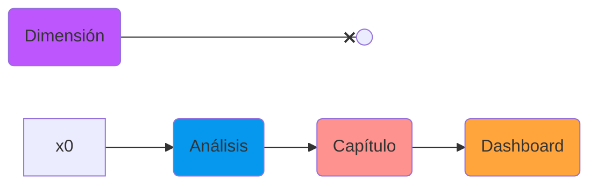

# md_mermaid
probando mermaid en markdown


```mermaid
graph LR

x1("Dimensión") ---x0((" "))
x0-->x2("Análisis") 
x2 --> x3("Capítulo")
x3 --> x4("Dashboard")
style x1 fill:#bd57fd
style x2 fill:#0698ee
style x3 fill:#fd928f
style x4 fill:#ffa53c


```

```
<div class="mermaid">
graph LR
        A-->B
        B-->C
        C-->A
        D-->C
</div>
```

